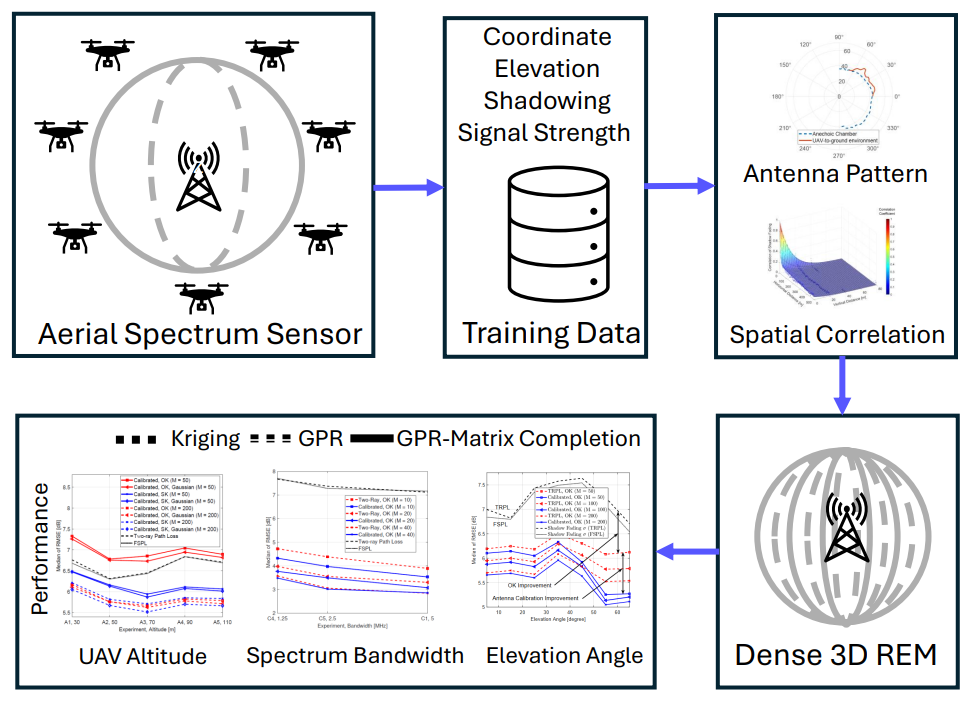
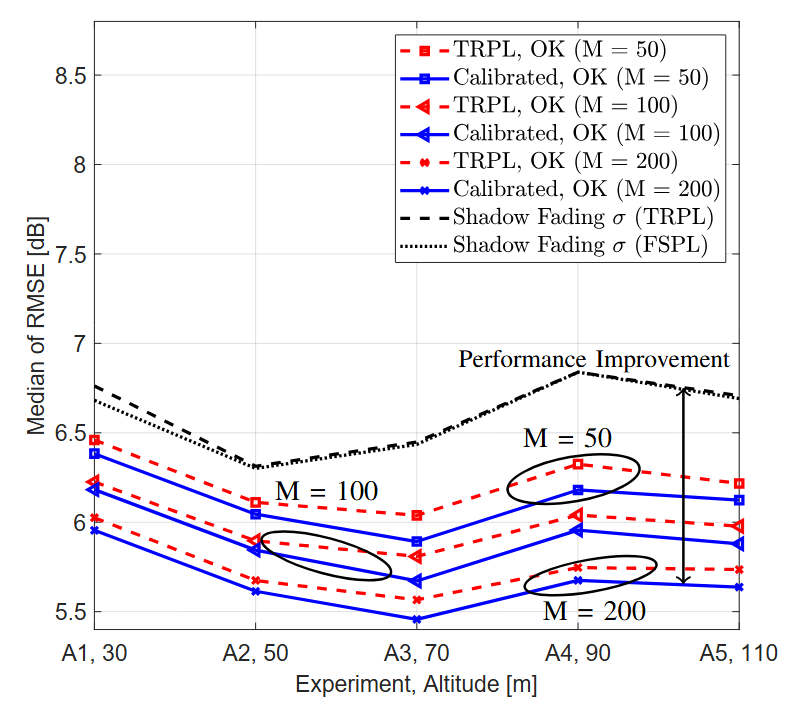
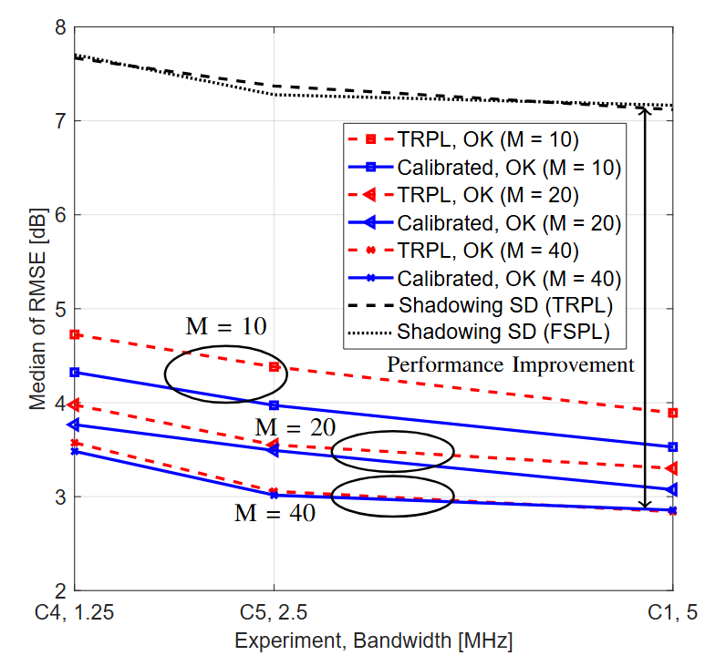
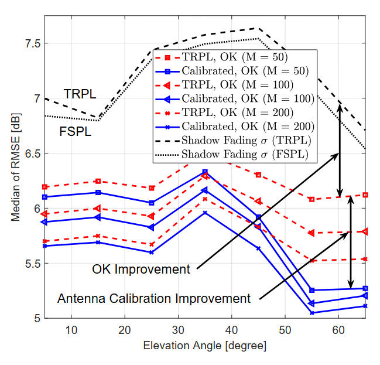
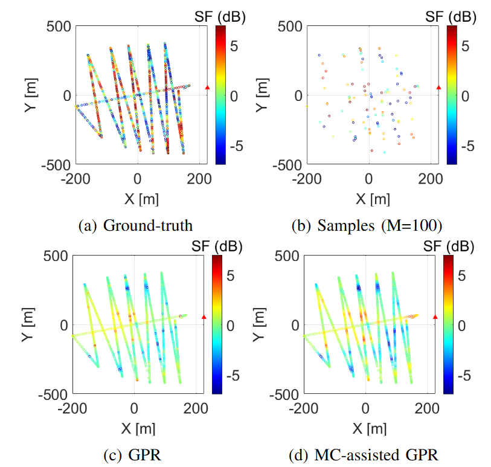
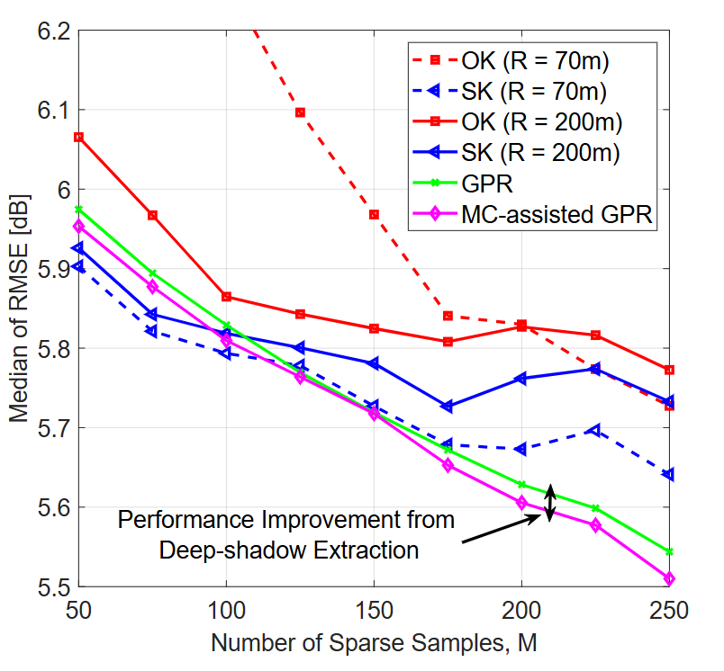

# UAV-Based 3D Spectrum Sensing and REM Reconstruction

This repository contains the code implementation for the research paper titled **UAV-Based 3D Spectrum Sensing: Insights on Altitude, Bandwidth, Trajectory, and Effective Antenna Patterns on REM Reconstruction**. The paper focuses on **systematically evaluating how physical sensing properties, localized environmental characteristics, and UAV-specific hardware effects intrinsically affect Radio Environment Map (REM) reconstruction accuracy**. This code allows you to replicate the experiments described in the paper and explore the results.

## General Introduction

The core task of this project is to build a dense REM from sparse signal strength data collected using a UAV. In this paper, we investigate **the sensitivity of REM reconstruction to physical sensing parameters (sensing altitude from the ground, spectrum bandwidth, elevation angle with respect to the signal source) and the structural effects of the UAV airframe**. 

The goal of the study is to **benchmark diverse spatial prediction models under varying flight dynamics to understand the inherent difficulty of REM reconstruction across different flight conditions. Furthermore, we aim to improve reconstruction accuracy by actively learning and compensating for airframe-induced hardware effects and environmental characteristics, such as localized deep shadowing.** This repository provides the code for the experimental setups, data processing pipelines, and the final evaluated results. 

The objectives of this study can be divided into 4 main directions:

1. How do UAV altitude and elevation angle affect reconstruction accuracy?
2. How does the spectrum bandwidth impact reconstruction accuracy?
3. Can we improve reconstruction accuracy by learning and modeling the UAV's structural airframe effects?
4. Can we enhance reconstruction accuracy by explicitly extracting and propagating deep-shadowed zones within a radio map?



### Key Highlights:
- **Approach**: We benchmarked **Baselines: Two-Ray Path Loss (TRPL) modeling, Kriging (simple, ordinary, and trans-Gaussian variants), and Gaussian Process Regression (GPR)**. To enhance performance, we proposed **Our Methods: a novel Matrix Completion (MC)-assisted GPR framework for deep-shadow extraction, and an in-flight antenna pattern calibration technique**.
- **Data**: The dataset used in this research consists of empirical real-world UAV measurements from the **AERPAW LTE I/Q dataset, AERPAW Find-a-Rover (AFAR) dataset, and AERPAW multi-band dataset**.
- **Results**: The findings from the research highlight four main contributions: 
  **(1) Flight Geometry Insights**: REM accuracy follows a distinct tri-phasic trend across UAV altitudes, while shadowing variance peaks non-monotonically at both very low and mid-high elevation angles. 
  **(2) Bandwidth Impact**: REM accuracy significantly improves with increased spectrum bandwidth due to enhanced frequency diversity, mitigating multipath fading. 
  **(3) Deep-Shadow Extraction**: The proposed Matrix Completion (MC)-assisted GPR framework enhances accuracy by decomposing the REM to isolate and propagate critical localized extrema without oversmoothing. 
  **(4) Antenna Calibration**: Utilizing an effective antenna radiation pattern calibrated directly from in-field measurements substantially enhances accuracy by accounting for airframe-induced electromagnetic interference.
  
## Representative Result

Impact of Sensing Altitude (tri-phasic behavior):



Impact of Sensing Bandwidth (monotonic performance improvement with bandwidth):



Performance Improvement with Learning UAV Airframe Structure (Performance Improvement from antenna calibration):



Performance Improvement with MC Assisted GPR (Performance Improvement from deep-shadow extraction):




## How to Run This Code

### Prerequisites

Before running the code, make sure you have the following installed:

- Matlab R20022b or newer
- Required Matlab addons:
  - `Optimization Toolbox`
  - `Symbolic Math Toolbox`
  - `Signal Processing Toolbox`


# Running the Code

### Clone the Repository:

To get started, clone this repository to your local machine:

```bash
git clone https://github.com/MPACT-Lab/uav-spectrum-sensing-insights.git
```
### Result Demonstration:

- **Evaluation of Proposed MC-assited GPR**: 

Run ```GPR/performance_eval_mc_assisted_gpr.m``` to plot the comparative result of MC-assisted GPR with baselines (Fig. 17 of the Paper)

- **Evaluation of Effective Antenna Pattern and Performance variation across Altitude, Elevation Angle**: 

Run ```REM_performance_across_altitude.m``` to plot the REM reconstruction performance across altitude (Fig. 12 of the Paper)

Run ```REM_performance_across_elevation_angle.m``` to plot the REM reconstruction performance across elevation angle (Fig. 10 of the Paper)

- **Performance Comparison among Kriging Variants**: 

#### 📦 Rejoin Large Mat File
Due to GitHub's file size limits, the file `res_kriging_ordinary....mat` within `kriging/results` has been split into smaller chunks (`data_part_*`). Follow the instructions below to rejoin them:

##### 🐧 Linux, macOS, and Git Bash (Windows)
Open the terminal in the `kriging/results` directory and run:
```cat data_part_* > res_kriging_ordinary_gaussian_sung_joon_50_250_3_a2g_5k.mat```

Then run ```REM_performance_across_Kriging_variants.m``` to compare performance among OK, SK, and their Gaussian variants (Fig. 12 of the Paper)

The scripts above compare the performance of methods using pre-computed REMs. To generate REMs from scratch, follow the instructions below.

### Running Step-By-Step Specific Modules:

- **Data Preprocessing**:

To estimate the path loss using free-space path loss and two-ray path loss (TRPL):

```bash
cd data_gen
```

For AERPAW LTE I/Q dataset:

Run ```LTE_dataset/data_gener_lte_sensors.m```.

For AFAR dataset:

Run ```AFAR_dataset/data_gener_afar_sensors.m```.

For AERPAW multi-band dataset:

Run ```Multi_BW_dataset/data_gener_cole_sensors.m```.

- **Effective Antenna Pattern Learning**: 

To learn the structural effect of the UAV airframe:

```bash
cd effect_ant_patt
```
then run ```antenna_placement_effect_learning.m```

- **Spatial Correlation Modeling**: 

To learn the spatial correlation model of shadow fading:

```bash
cd corr_profile
```
Then run one of the following for the targeted reconstruction method.

Run ```threed_corr_gen_ok_sk.m``` compatible with OK, SK.
Run ```threed_corr_gen_ok_sk_ant.m``` compatible with OK, SK using effective antenna pattern.
Run ```threed_corr_gen_trans_ok_sk.m``` compatible with trans-Gaussian OK/SK.

- **REM reconstruction using Baseline Kriging Approach**: 

To measure REM reconstruction results with baseline Kriging variants:

```bash
cd kriging
```
Then run one of the following for the targeted Kriging variant.

Run ```kriging_ordinary.m``` for Ordinary Kriging (OK).
Run ```kriging_ordinary_transgaussian.m``` for trans-Gaussian OK.
Run ```kriging_simple.m``` for Simple Kriging (SK).
Run ```kriging_simple_transgaussian.m``` for trans-Gaussian SK.

- **REM reconstruction using effective antenna pattern**: 

To measure REM reconstruction results for baseline Kriging variants:

```bash
cd kriging
```
Then run one of the following for the targeted Kriging variant.

Run ```kriging_ordinary_ant.m``` for Ordinary Kriging (OK).
Run ```kriging_ordinary_transgaussian_ant.m``` for trans-Gaussian OK.
Run ```kriging_simple_ant.m``` for Simple Kriging (SK).
Run ```kriging_simple_transgaussian_ant.m``` for trans-Gaussian SK.

- **REM reconstruction using baseline GPR**: 

To measure REM reconstruction results for GPR:

```bash
cd GPR
```
then run ```threed_corr_gen_GPR.m``` followed by ```gpr.m```.
To generate comparable results with ordinary Kriging and Simple Kriging, run ```ok.m``` and ```sk.m```.

- **REM reconstruction using proposed MC-assisted GPR**: 

To measure REM reconstruction results for MC-assisted GPR:

```bash
cd mc-Assisted_GPR
```
then run ```mcGPR.m```.

## License

This code is released under the MIT License. <!--See the [LICENSE](LICENSE) file for more details.-->

## Citing This Work

If you use this code or refer to the work in your own research, please cite the following paper:

**Mushfiqur Rahman, Sung Joon Maeng, Ismail Guvenc, Chau-Wai Wong, Mihail Sichitiu, Jason A. Abrahamson, and Arupjyoti Bhuyan**. "UAV-Based 3D Spectrum Sensing: Insights on Altitude, Bandwidth, Trajectory, and Effective Antenna Patterns on REM Reconstruction" submitted to *IEEE Sensors*, 2026. <!-- [Volume], [Pages]. DOI: [DOI Number].-->

For more information, please refer to the full paper: **[https://arxiv.org/abs/2603.10362]**.
<!--## Acknowledgements

- **[Any Contributors or Funding Sources]**
- The authors would like to thank **[Individuals or Organizations]** for their support.

For more information, please refer to the full paper: **[Link to the paper]**.-->

## Contact

If you have any questions, feel free to open an issue or contact us at **iguvenc@ncsu.edu**.
